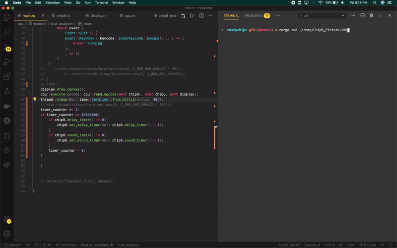

# Rusty Chips: A Chip8 Emulator in Rust

## Motivations
My attempt to learn Rust doing something fun. Surely not idiomatic Rust yet and probably a little dirty right now but, certainly serving its purpose of learning Rust. Also has the added benefit of being exposed to dealing with registers, bitwise ops, and some assembly-ish instructions.

## What is Chip8?
CHIP-8 is an interpreted programming language, developed by Joseph Weisbecker. It was initially used on the COSMAC VIP and Telmac 1800 8-bit microcomputers in the mid-1970s. CHIP-8 programs are run on a CHIP-8 virtual machine. It was made to allow video games to be more easily programmed for these computers.  
Source: [Wikipedia](https://en.wikipedia.org/wiki/CHIP-8).  
Specifications: [Cowgod's Chip-8 Technicl Reference](http://devernay.free.fr/hacks/chip8/C8TECH10.HTM#2.2)

### TLDR -> You can **play Pong!**

&nbsp;

## Functionality Still To Be Implemented
- [x] key press events
- [ ] track down collision bug.
- [ ] fix font set opcode
- [ ] sounds
- [ ] move opcode instructions to functions in separate file
- [ ] clean up debug print statements
- [ ] general cleanup / refactor messy bits

&nbsp;

# Installation

- install rust stable
- in the terminal: `brew install sdl2`
- clone repo
- cd into root directory
- in the terminal: `cargo run <path to rom>`
  - (ex: `cargo run ./roms/chip8_picture.ch8`) 
- press `esc` to close window
